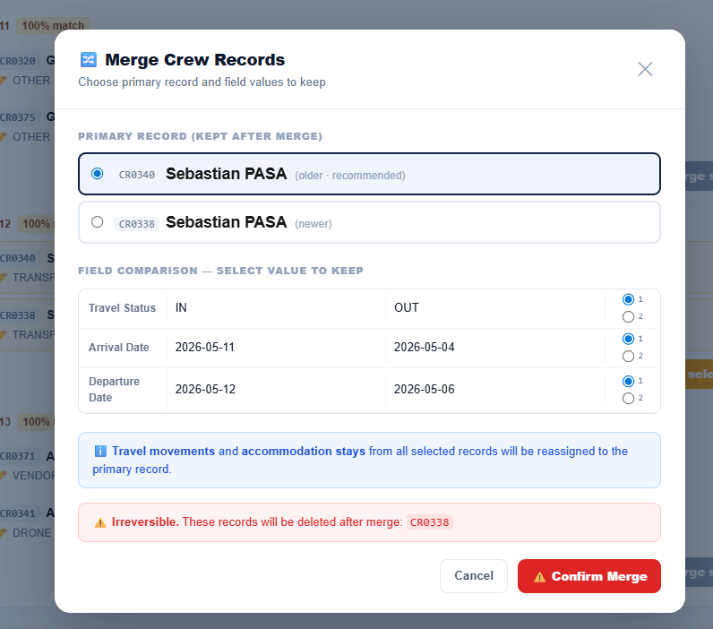

## WHAT CHANGED IN SESSION S57 (12 May 2026)

### Feature ✅ — Travel: auto-sync `crew.arrival_date` / `departure_date` / `travel_status` dal sidebar

**Obiettivo**: quando si salva un `travel_movement` con `crew_id` settato, aggiornare automaticamente le date e lo status del record crew corrispondente, senza dover aprire la pagina Crew manualmente.

#### `app/dashboard/travel/page.js` — nuova funzione `syncCrewDates`

Aggiunta dentro `MovementSidebar`, chiamata (fire-and-forget) dopo ogni save riuscito in **`handleSubmit`** e **`handleSaveAndAddLeg`**.

**Logica**:
1. Carica `crew.arrival_date`, `crew.departure_date`, `crew.travel_status` per il `crew_id` del movimento
2. Aggiorna le date **solo se più estreme** (non distruttivo):
   - `direction === 'IN'`: aggiorna `arrival_date` se null o `travelDate < arrival_date`
   - `direction === 'OUT'`: aggiorna `departure_date` se null o `travelDate > departure_date`
3. Ricalcola `travel_status` replicando esattamente `expectedStatus()` di `crew/page.js`:
   - `today > departure_date` → `'OUT'`
   - `today > arrival_date` → `'PRESENT'`
   - `today === arrival_date` + saving IN movement today → `'IN'`; else → `'PRESENT'`
   - `today < arrival_date` → `'IN'`
4. Esegue `crew.update(updates)` solo se c'è effettivamente qualcosa da cambiare

**Effetto**: dopo aver aggiunto un volo IN per un crew member, Hub Coverage e Pax Coverage mostrano automaticamente il membro nella data corretta con lo status aggiornato.

**Non tocca**: movimenti non matchati (`crew_id = null`); non fa rollback se si elimina un movimento.

#### Bugfix durante lo sviluppo (3 iterazioni)

**Bug 1** (`25612f7`): l'`if (Object.keys(updates).length === 0) return` era PRIMA del calcolo del `newStatus`. Se le date erano già corrette nel DB, `updates` rimaneva vuoto e il `travel_status` non veniva mai toccato.
→ Fix: spostato il check vuoto DOPO `if (newStatus && newStatus !== crewRec.travel_status) updates.travel_status = newStatus`

**Bug 2** (`6458d8d`): se il crew aveva `departure_date` in passato (vecchio stint) e si salvava un nuovo IN, la logica `today > departure_date → 'OUT'` bloccava tutto.
→ Fix: se `travelDate > crewRec.departure_date` (ritorno dopo partenza) → reset `departure_date = null` + set nuova `arrival_date`

**Bug 3** (`1593d7f`): `null ?? crewRec.departure_date` restituisce il valore del DB (il `??` tratta `null` come assente → usa il fallback). Quindi anche dopo il reset, `dep` usava ancora il vecchio valore in memoria.
→ Fix: sostituiti i due `??` con `'departure_date' in updates ? updates.departure_date : crewRec.departure_date` — così un `null` esplicito viene rispettato.

---

## WHAT CHANGED IN SESSION S56 (12 May 2026)

### Feature ✅ — Travel: multi-leg journey support — commit `e7dc69e`

**Obiettivo**: permettere di inserire più leg (volo + treno, coincidenze, ecc.) per la stessa persona, raggruppati visivamente nella tabella e inseribili in modo guidato dal sidebar.

#### Nuova colonna DB — `travel_movements.journey_id` (`scripts/migrate-travel-journey.sql`)
```sql
ALTER TABLE travel_movements ADD COLUMN IF NOT EXISTS journey_id UUID DEFAULT NULL;
CREATE INDEX IF NOT EXISTS idx_travel_movements_journey ON travel_movements(journey_id) WHERE journey_id IS NOT NULL;
```
- Nullable: i movement esistenti hanno `journey_id = NULL` (retrocompatibile)
- I leg dello stesso viaggio condividono lo stesso UUID

#### `app/dashboard/travel/page.js`

**`buildDisplayRows(rows)`** — nuova funzione pura (prima di `SectionTable`):
- Raggruppa i row per `journey_id`, ordina ogni gruppo per `from_time`
- Aggiunge a ogni row: `legIndex` (-1=standalone, 0=primo, 1+=successivo) e `journeySize`
- Ordina i gruppi per `from_time` del primo leg (analogo ai standalone)
- `SectionTable` usa `buildDisplayRows(rows)` invece di `rows` direttamente

**`renderCell` — caso `full_name` aggiornato**:
- `legIndex > 0` → mostra `↩ leg N` (grigio, paddingLeft 20px) invece del nome
- `legIndex === 0 && journeySize > 1` → mostra badge viola `N✈` accanto al nome

**`SectionTable` — styling leg rows**:
- Bordo sinistro dei leg 2+ = stesso colore con alpha 88% (`${borderColor}88`)
- `opacity: 0.9` per i leg successivi

**`MovementSidebar`** — nuove funzionalità:
- Prop aggiuntiva: `onAddLeg(savedMovement)` — callback per aprire il leg successivo
- `EMPTY_MOV` ora include `journey_id: null`
- `buildRow()` — helper che costruisce il payload row (riduce duplicazione)
- `SELECT_FIELDS` — costante stringa Supabase centralizzata (include `journey_id`)
- `handleSaveAndAddLeg()` — salva con `journey_id` (via `crypto.randomUUID()`) e chiama `onAddLeg`
- Branch `mode === 'new' && initial?.__isLeg` nel `useEffect` di inizializzazione form: pre-compila dalla `prevMovement` passata da `openAddLeg`
- `isLegMode` flag: header viola `#4c1d95`, titolo "↩ Connecting Leg", banner "Multi-leg journey" con journey_id abbreviato
- Footer: tasto primario "Add Movement" / "Save Changes" + riga secondaria [Cancel | ↩ Save & Add Connecting Leg]

**`openAddLeg(prevMovement)`** — nuova funzione in `TravelPage`:
- Crea `nextLeg` con `__isLeg: true`, stesso `journey_id`, stessa data/direzione/tipo/persona
- `from_location` = `prevMovement.to_location`, `from_time` = `prevMovement.to_time`
- Apre sidebar in mode `'new'` con `sidebarTarget = nextLeg`

**`MovementSidebar` nel render**: ora riceve `onAddLeg={openAddLeg}`

---

## WHAT CHANGED IN SESSION S55 (12 May 2026)

### Feature ✅ — Travel: colonne configurabili per produzione — commits `3195194` + `95d9660`

**Obiettivo**: rendere la tabella `/dashboard/travel` completamente data-driven. Le colonne visibili, il loro ordine e la loro larghezza sono configurabili per produzione e persistiti in DB nella tabella `travel_columns`.

#### Nuova tabella DB — `travel_columns` (`scripts/migrate-travel-columns.sql`)
```sql
CREATE TABLE IF NOT EXISTS travel_columns (
  id             UUID DEFAULT gen_random_uuid() PRIMARY KEY,
  production_id  TEXT NOT NULL,
  source_field   TEXT NOT NULL,
  header_label   TEXT NOT NULL,
  width          TEXT NOT NULL DEFAULT '110px',
  display_order  INTEGER DEFAULT 10,
  created_at     TIMESTAMPTZ DEFAULT now(),
  updated_at     TIMESTAMPTZ DEFAULT now()
);
CREATE INDEX IF NOT EXISTS idx_travel_columns_production ON travel_columns(production_id);
ALTER TABLE travel_columns ENABLE ROW LEVEL SECURITY;
CREATE POLICY "production members can manage travel columns" ON travel_columns USING (true) WITH CHECK (true);
```
- `production_id` è TEXT (coerente con le altre tabelle)
- 1 riga per colonna per produzione, ordinate per `display_order` (multipli di 10)

#### Nuovi file

**`lib/travelColumnsCatalog.js`** — Catalogo dei 13 campi configurabili
- `TRAVEL_COLUMNS_CATALOG` — object con 13 chiavi (`direction`, `full_name`, `crew_role`, `pickup_dep`, `from_location`, `from_time`, `to_location`, `to_time`, `travel_number`, `pickup_arr`, `needs_transport`, `notes`, `match_status`), ognuna con `label` e `defaultWidth`
- `TRAVEL_DEFAULT_PRESET` — array di 13 colonne con `source_field`, `header_label`, `width`, `display_order` (10–130)

**`lib/TravelColumnsEditorSidebar.js`** — Sidebar editor colonne
- Architettura speculare a `lib/ColumnsEditorSidebar.js` (usato da Lists-v2)
- Drag & drop con `@dnd-kit/core` + `@dnd-kit/sortable` per riordinare colonne
- Form add/edit: select semplice (no category grouping), header label, width select
- `WIDTH_OPTIONS` ottimizzato per Travel: 38px, 44px, 52px, 56px, 76px, 80px, 90px, 110px, 120px, 130px, 160px, 200px, 1fr
- Pulsante "Reset to Default" → cancella tutto e reinserisce i 13 colonne preset
- **Fix `95d9660`**: `useRef` + auto-scroll al form quando si clicca "edit" (il form era nascosto sotto le 13 righe della lista); form evidenziato in giallo in edit mode; aggiunto `44px` a `WIDTH_OPTIONS` (mancava ma usato da `match_status` nel preset)
- Persistenza: `supabase.from('travel_columns')` — load, insert, update, delete

#### File modificato

**`app/dashboard/travel/page.js`** — Refactoring completo data-driven
- **Imports**: `TravelColumnsEditorSidebar`, `TRAVEL_DEFAULT_PRESET`
- **Nuovi stati**: `columnsConfig[]`, `columnsEditorOpen`, `applyingPreset`
- **`loadColumnsConfig()`**: `useCallback` che carica da `travel_columns` per `PRODUCTION_ID`, ordinato per `display_order` + `created_at`
- **`applyDefaultPreset()`**: inserisce `TRAVEL_DEFAULT_PRESET` in DB + reload
- **Toolbar**: pulsante "Columns" (apre sidebar) + pulsante "Apply Default Columns" (visibile solo se `columnsConfig.length === 0`)
- **Content area**: rimosso `maxWidth` vincolante — solo `padding: '16px 24px'`
- **`SectionTable`**: riceve prop `columnsConfig`
  - `<colgroup>` dinamico generato da `columnsConfig` + colonna Edit fissa 38px
  - `<thead>` dinamico con `col.header_label`
  - `renderCell(col, m, ctx)` — switch su `source_field` (13 casi):
    - `direction` → badge ↓ IN / ↑ OUT (statico, verde/arancio)
    - `full_name` → nome crew (statico)
    - `crew_role` → ruolo (statico)
    - `pickup_dep`, `from_location`, `to_location`, `travel_number`, `pickup_arr` → `<EditableCell>` text
    - `from_time`, `to_time` → `<EditableCell type="time">`
    - `notes` → `<EditableCell type="textarea">`
    - `needs_transport` → `<NeedsTransportCell>` (toggle 🚐)
    - `match_status` → ✅/❌ (statico)
  - Colonna Edit ✎ fissa come ultima (non parte della config)
- **Placeholder** se `columnsConfig.length === 0`: card con bottone "Apply Default Columns"
- **`TravelColumnsEditorSidebar`** integrato nel render con `onChanged={loadColumnsConfig}`
- Sistema `cell_colors` (right-click → ColorPickerPopover) e `MovementSidebar` invariati

#### Commits S55
| Hash | Descrizione |
|---|---|
| `3195194` | `feat(travel): TV-1/2/3 — colonne configurabili travel_columns + sidebar + page refactor` |
| `95d9660` | `fix(travel): sidebar edit — auto-scroll al form + aggiunge 44px a WIDTH_OPTIONS + evidenzia form in edit mode` |

#### ⚠️ Azione manuale richiesta
Eseguire `scripts/migrate-travel-columns.sql` nel pannello SQL di Supabase per creare la tabella `travel_columns` in produzione.

---

  - 📍 Set & Basecamp: set_location, set_address, basecamp
- **Logo upload**: `<input type="file" accept="image/*">` → preview immediata con `URL.createObjectURL`
- **Save**: `uploadLogo()` → `POST /api/productions/upload-logo` → poi `PATCH /api/productions` con tutti i campi
- Tip: link a `/dashboard/lists` per vedere il header con i dati della produzione

**`app/api/productions/upload-logo/route.js`** — `POST /api/productions/upload-logo`:
1. Verifica sessione Supabase (auth user)
2. Verifica che l'utente abbia un ruolo per la produzione (`user_roles`)
3. Legge il file da FormData
4. Upload via **service-role client** → `production-logos` bucket → `{productionId}/logo.{ext}` (upsert)
5. Ottiene URL pubblico con `?t=Date.now()` (cache-bust)
6. Response: `{ logo_url }`

**Nota**: bypass necessario perché le policy RLS di Supabase Storage non permettono upload diretto dal client per il bucket `production-logos`.

**Nuovi campi DB `productions`** (migration `scripts/migrate-productions-details.sql`):
```sql
ALTER TABLE productions ADD COLUMN IF NOT EXISTS director TEXT;
ALTER TABLE productions ADD COLUMN IF NOT EXISTS producer TEXT;
ALTER TABLE productions ADD COLUMN IF NOT EXISTS production_manager TEXT;
ALTER TABLE productions ADD COLUMN IF NOT EXISTS production_manager_phone TEXT;
ALTER TABLE productions ADD COLUMN IF NOT EXISTS production_coordinator TEXT;
ALTER TABLE productions ADD COLUMN IF NOT EXISTS production_coordinator_phone TEXT;
ALTER TABLE productions ADD COLUMN IF NOT EXISTS transportation_coordinator TEXT;
ALTER TABLE productions ADD COLUMN IF NOT EXISTS transportation_coordinator_phone TEXT;
ALTER TABLE productions ADD COLUMN IF NOT EXISTS transportation_captain TEXT;
ALTER TABLE productions ADD COLUMN IF NOT EXISTS transportation_captain_phone TEXT;
ALTER TABLE productions ADD COLUMN IF NOT EXISTS production_office_phone TEXT;
ALTER TABLE productions ADD COLUMN IF NOT EXISTS set_location TEXT;
ALTER TABLE productions ADD COLUMN IF NOT EXISTS set_address TEXT;
ALTER TABLE productions ADD COLUMN IF NOT EXISTS basecamp TEXT;
ALTER TABLE productions ADD COLUMN IF NOT EXISTS general_call_time TIME;
ALTER TABLE productions ADD COLUMN IF NOT EXISTS shoot_day INTEGER;
ALTER TABLE productions ADD COLUMN IF NOT EXISTS revision INTEGER DEFAULT 1;
ALTER TABLE productions ADD COLUMN IF NOT EXISTS logo_url TEXT;
```

---

### Stato commits S54 (10 May 2026)
| Hash | Commit |
|---|---|
| `a0129c9` | EG-2A: add list columns catalog with renderers (incl. maps links, Captain Preset) |
| `1dc42f9` | EG-2B: data-driven trip rows from DB columns config + Apply Captain Preset button |
| `874dd89` | EG-3: Columns editor sidebar with add/edit/delete + Reset to Captain Preset |
| `564f700` | EG-4: drag-and-drop column reorder in Columns editor (with @dnd-kit/sortable) |
| `f227503` | EG-5: print/PDF refinements (no-print toolbar, page-break-avoid trips, repeated col-header, maps link compact vs full variants) |
| `e35ce66` | EG-fix-1: load driver phone from crew table by name match |
| `0c39fed` | EG-fix-2: add 4 combined renderers (pickup/dropoff: name + address + maps link, compact and URL variants) |
| `cb9ca72` | fix: use API route for logo upload in production settings (bypass Storage RLS) |

---

## WHAT CHANGED IN SESSION S53 (9 May 2026)

### Feature ✅ — `/dashboard/settings` page con Google Drive connect/disconnect — commit `dbf6f62`

**File nuovi**:
- `app/dashboard/settings/page.js` — pagina Settings (client component)
- `app/api/google/status/route.js` — GET endpoint stato connessione Google Drive

**`app/dashboard/settings/page.js`**:
- Wrapped in `<Suspense>` (`SettingsPageWrapper` → `SettingsPage`) perché usa `useSearchParams()` (regola Next.js App Router)
- Auth guard: redirect `/login` se non loggato
- **Flash message**: legge `?google=connected` o `?google=error&reason=...` dai query params (settati da `/api/auth/google/callback`). Dopo averli letti, li rimuove con `window.history.replaceState` per evitare re-flash al refresh
- **Card Google Drive**:
  - Stato connesso: mostra `✅ Connesso`, `google_email`, `connected_at` formattata, `last_refresh_error` (se presente)
  - Bottoni: `🔄 Riconnetti` (link `<a>` → `/api/auth/google/connect`) + `✕ Disconnetti` (POST `/api/auth/google/disconnect`)
  - Stato non connesso: mostra `⚪ Non connesso` + warning schermata unverified app + bottone `🔗 Connetti Google Drive`
- **Card Account**: mostra `user.email` dell'utente loggato (placeholder per funzionalità future)
- Design: `Navbar` + `PageHeader`, palette `#0f2340/#f8fafc/#2563eb`, inline styles (pattern uguale a `/dashboard/locations`)

**`app/api/google/status/route.js`**:
- `GET /api/google/status`
- Usa `@supabase/ssr` con cookie per autenticare l'utente corrente
- Usa service-role client per leggere `user_google_tokens` (bypass RLS)
- Response: `{ connected: false }` oppure `{ connected: true, google_email, connected_at, scope, last_refresh_error }`
- `export const dynamic = 'force-dynamic'`

### Feature ✅ — Navbar: Settings entry in NAV_SECONDARY — commit `ca18c2f`

**File**: `lib/navbar.js`
- Aggiunta voce `Settings` con path `/dashboard/settings` nel dropdown secondario della navbar

---

## WHAT CHANGED IN SESSION S52 (18 Apr – 9 May 2026)
### Google OAuth per-user — sistema completo

> **Obiettivo**: ogni utente CaptainDispatch può connettere il proprio Google Account. Il `refresh_token` viene cifrato a riposo in DB. Il sistema Drive usa il token dell'owner del file invece del `provider_token` della sessione (che scadeva dopo 1h).

#### Nuova tabella DB: `user_google_tokens`
```sql
CREATE TABLE user_google_tokens (
  user_id               UUID PRIMARY KEY REFERENCES auth.users(id) ON DELETE CASCADE,
  refresh_token_encrypted TEXT NOT NULL,  -- AES-256-GCM encrypted
  scope                 TEXT,
  google_email          TEXT,
  connected_at          TIMESTAMPTZ DEFAULT now(),
  last_refresh_error    TEXT,
  last_refresh_error_at TIMESTAMPTZ
);
-- RLS: solo service-role può leggere/scrivere (nessuna policy per anon/authenticated)
```

#### Nuovi file

**`lib/crypto.js`** — commit `5c60eb2`
- Helper AES-256-GCM per cifrare/decifrare stringhe sensibili a riposo
- `encrypt(plaintext)` → stringa `"iv:authTag:ciphertext"` (tutto hex)
- `decrypt(payload)` → plaintext originale
- Legge chiave da env var `GOOGLE_TOKEN_ENCRYPTION_KEY` (64 hex chars = 32 bytes)
- Usato da: `app/api/auth/google/callback/route.js` (encrypt) e `lib/googleClient.js` (decrypt)

**`lib/googleClient.js`** — commit `dda3b31`
- `getGoogleOAuthClient(userId)` → `OAuth2Client` autenticato per l'utente dato
  - Legge `refresh_token_encrypted` da `user_google_tokens` tramite service-role
  - Decifra con `decrypt()` da `lib/crypto.js`
  - Ritorna `google.auth.OAuth2` con `refresh_token` settato (auto-refresh access_token)
  - Errori: `'NO_GOOGLE_TOKEN'`, `'TOKEN_DECRYPT_FAILED'`, `'GOOGLE_OAUTH_ENV_MISSING'`
- `getDriveClient(userId)` → convenience wrapper che ritorna `drive_v3` client

**`app/api/auth/google/connect/route.js`** — commit `1f669c1`
- `GET /api/auth/google/connect`
- Avvia il flow OAuth Google:
  1. Verifica sessione Supabase (redirect `/login` se non loggato)
  2. Genera CSRF state (32 bytes hex) → cookie `g_oauth_state` (HttpOnly, Secure, 10 min)
  3. Costruisce URL Google con `access_type=offline`, `prompt=consent`, scope `drive.readonly + userinfo.email`
  4. Redirect 303 → Google

**`app/api/auth/google/callback/route.js`** — commit `8662ebb`
- `GET /api/auth/google/callback?code=...&state=...`
- Completa il flow OAuth:
  1. Verifica CSRF state (cookie `g_oauth_state` == query param `state`)
  2. Verifica sessione Supabase
  3. Scambia `code` con Google → `access_token + refresh_token`
  4. Se no `refresh_token` → error `no_refresh_token` (mitigato da `prompt=consent`)
  5. Fetch email Google dell'utente (`oauth2.userinfo.get()`)
  6. Cifra `refresh_token` con `encrypt()` da `lib/crypto.js`
  7. Upsert in `user_google_tokens` (conflict: `user_id`)
  8. Redirect → `/dashboard/settings?google=connected` o `?google=error&reason=...`
- Cookie `g_oauth_state` viene cancellato alla fine (Max-Age=0)

**`app/api/auth/google/disconnect/route.js`** — commit `72ef5f3`
- `POST /api/auth/google/disconnect`
- Disconnette Google Drive dell'utente corrente:
  1. Verifica sessione Supabase
  2. Carica `refresh_token_encrypted` da `user_google_tokens`
  3. Best-effort revoke su `https://oauth2.googleapis.com/revoke` (non blocca se fallisce)
  4. DELETE dalla tabella `user_google_tokens` (sempre, anche se revoke ha fallito)
  5. Response: `{ ok: true, revoke_status: 'revoked'|'skipped'|'revoke_threw'|... }`

#### Env vars richieste (nuove)
| Variabile | Descrizione |
|---|---|
| `GOOGLE_OAUTH_CLIENT_ID` | OAuth 2.0 client ID da Google Cloud Console |
| `GOOGLE_OAUTH_CLIENT_SECRET` | OAuth 2.0 client secret |
| `GOOGLE_OAUTH_REDIRECT_URI` | `https://captaindispatch.com/api/auth/google/callback` |
| `GOOGLE_TOKEN_ENCRYPTION_KEY` | 64 hex chars (32 bytes) — `node -e "console.log(require('crypto').randomBytes(32).toString('hex'))"` |

#### `app/api/drive/check-updates/route.js` — migrazione — commit `3674699`

**Cambiamento principale**: rimosso uso di `provider_token` dalla sessione utente corrente (scadeva dopo 1h). Ora ogni file in `drive_synced_files` ha `owner_user_id` → il check-updates carica il client Drive dell'owner del file via `getGoogleOAuthClient(owner_user_id)`.

- Cache per `owner_user_id`: un solo `OAuth2Client` per owner per request (lazy, `Map`)
- File senza `owner_user_id`: skippati con `{ id, reason: 'no_owner_user_id' }`
- Errori categorizzati: `owner_not_connected_to_drive`, `token_decrypt_failed`, `google_env_missing`
- Response aggiornata: `{ files: [...], skipped: [{ id, reason }] }`

---

## WHAT CHANGED IN SESSION S51 (18 April 2026)

### Feature ✅ — `CrewDuplicatesWidget` in Bridge — commit `efd8bd9`

**File nuovi/modificati**:
- `app/api/crew/merge/route.js` (nuovo)
- `app/dashboard/bridge/page.js` (+298 righe)

**`app/api/crew/merge/route.js`** — `POST /api/crew/merge`
- Riceve `{ winner_id, loser_id, production_id }`
- Verifica autenticazione Supabase
- Operazioni atomiche (in ordine):
  1. Ri-assegna `travel_movements.crew_id: loser → winner`
  2. Ri-assegna `crew_stays.crew_id: loser → winner` (skip duplicati su `crew_id + arrival_date`)
  3. Ri-assegna `trip_passengers.crew_id: loser → winner` (skip duplicati su `trip_row_id + crew_id`)
  4. DELETE del crew `loser_id` dalla tabella `crew`
- Response: `{ ok: true, merged: { travel_movements, stays, trips } }`

**`CrewDuplicatesWidget`** (in `app/dashboard/bridge/page.js`):
- Rileva crew con stesso `full_name` (case-insensitive, trim) nella stessa produzione
- Raggruppa i duplicati in coppie: mostra dept, hotel, travel_status, date arrivo/partenza per ognuno
- UI: card per ogni coppia con due colonne (A vs B) + bottoni `Keep A / Discard B` e `Keep B / Discard A`
- Merge: chiama `POST /api/crew/merge` con `winner_id` e `loser_id`
- Dopo merge: ricarica la lista duplicati
- Posizionato come nuovo widget nel Bridge accanto agli altri widget esistenti

---

## WHAT CHANGED IN SESSION S50 (12 April 2026)

### Hotfix ✅ — Crew page: travelMap mostra movimenti ultimi 7 giorni — commit `d3fb741`

**File**: `app/dashboard/crew/page.js` — `loadCrew()`

**Problema**: la query `travel_movements` in `loadCrew` aveva `.gte('travel_date', today)` → caricava solo movimenti da oggi in poi. I movimenti passati (ieri, giorni precedenti) non apparivano nelle crew cards anche se erano presenti nel TravelAccordion della sidebar (che carica tutto senza filtri).

**Fix**:
```js
// PRIMA (bug):
.gte('travel_date', new Date().toLocaleDateString('en-CA', { timeZone: 'Europe/Rome' }))

// DOPO (fix):
.gte('travel_date', (() => { const d = new Date(); d.setDate(d.getDate() - 7); return d.toLocaleDateString('en-CA', { timeZone: 'Europe/Rome' }) })())
```
- Finestra estesa a **oggi - 7 giorni** → le crew cards mostrano anche i movimenti recenti degli ultimi 7 giorni
- Query rimane leggera (nessun full-scan storico)

---

### Hotfix ✅ — Rocket: campo orario Dept Destinations troncato (AM/PM) — commit `7f51eb0`

**File**: `app/dashboard/rocket/page.js` — sezione "Dept Destinations"

**Problema**: nella grid `gridTemplateColumns: '1fr 90px'`, il campo `input[type="time"]` era costretto in soli 90px. I browser/OS con formato 12h (Windows, macOS con locale en-US) mostrano `07:00 AM` → la "M" finale veniva tagliata visivamente.

**Fix**: colonna time allargata da `90px` → `120px`:
```js
// PRIMA:
gridTemplateColumns: '1fr 90px'

// DOPO:
gridTemplateColumns: '1fr 120px'
```
- 120px è sufficiente per tutti i formati (24h `07:00` e 12h `07:00 AM`) su tutti i browser

---

## NEXT SESSION: S49 — Mobile Perfect (iOS + Android)

### Obiettivo
S48 ha coperto le pagine principali. Rimangono ancora parti di pagina che escono fuori dallo schermo su mobile. S49 completa il lavoro con un approccio professionale: nessun elemento fuori schermo, layout armonioso, touch targets corretti su iPhone E Android/Samsung.

### Principi tecnici S49 (cross-platform iOS + Android)

- **`100dvh`** (dynamic viewport height) con fallback `100vh` — Android Chrome nasconde/mostra la barra indirizzi
- **`touch-action: manipulation`** su tutti i button mobile → elimina delay 300ms tap su Android Chrome
- **`overscroll-behavior: contain`** sulle sidebar/scroll container → previene pull-to-refresh Android
- **`env(safe-area-inset-*)`** già attivi — su Android default a 0px (safe)
- **Touch targets** ≥ 36px min-height su mobile (Material Design + Apple HIG)
- **`min-width: 0`** su tutti i flex children per shrink corretto
- **NO larghezze fisse** su mobile — tutto `%` o `calc()` o `auto`
- **Input date**: `appearance: none` + stile custom per uniformare iOS/Android
- **sidebar `marginRight`**: 0 su mobile (sidebar è fullscreen 100vw → non spinge il content)

### TASK S49-1 — Trips page — Timeline Card mobile · `app/dashboard/trips/page.js` (PRIORITÀ MASSIMA)

**Problema**: tabella con 6 colonne fisse (~890px), nessun `useIsMobile`, `SIDEBAR_W=440` applicato anche su mobile

**Pattern scelto**: **Timeline Card** (stile Samsara/Google Calendar mobile)
- Ogni gruppo trip → card con barra colorata sinistra (verde ARRIVAL, arancio DEP, blu STD)
- Riga 1: orario grande bold a sinistra + veicolo a destra
- Riga 2: transfer_class badge + status badge
- Riga 3: rotta pickup → dropoff
- Riga 4: passeggeri abbreviati + contatore
- Tap → apre EditTripSidebar (fullscreen su mobile)

**Toolbar mobile in 2 righe** (sticky):
- Row 1 (top 52px): date nav ◀ date ▶ + Today + "+ New Trip" button
- Row 2 (top 104px): filtri class (ALL/ARR/DEP/STD) + status (ALL/PLANNED/DONE) pill

**Fix strutturali**:
- `import { useIsMobile }` aggiunto
- `marginRight: isMobile ? 0 : (anySidebarOpen ? SIDEBAR_W : 0)` per tutto il content
- Assign banner: `flexWrap: 'wrap'`, semplificato su mobile
- TableHeader nascosto su mobile (sostituito da card view)
- "+ New Trip" FAB (Floating Action Button) in basso su mobile come alternativa al bottone toolbar

### ✅ TASK S49-2 — Crew page refinements · `app/dashboard/crew/page.js` (DONE — commit 34abc64)

**Problemi**: body padding fisso, marginRight su mobile sbagliato, toolbar row 2 troppo affollata

**Fix applicati**:
- `const isMobile = useIsMobile()` aggiunto in `CrewPage()`
- Body container: `padding: isMobile ? '12px' : '24px'`
- `marginRight: isMobile ? 0 : (sidebarOpen ? SIDEBAR_W : 'auto')` — sidebar 100% width mobile
- Toolbar Row 1 mobile: nascosti badge contatori (IN/PRES/OUT/NTN/Remote/dep tomorrow), testo counts, pulsante Import — rimangono solo `👤 Crew` + `↻` + `+ Add Crew`
- Toolbar Row 2 mobile: `flexDirection: column`, `alignItems: stretch` — search `width: 100%`, travel filter su riga propria, hotel filter su riga propria, filter div con `flexWrap: 'wrap'`

### TASK S49-3 — Hub Coverage toolbar · `app/dashboard/hub-coverage/page.js`

**Problema**: toolbar singola riga con tutto dentro → esplode su mobile

**Fix**:
- Toolbar split in 2 righe (stessa strategia pax-coverage):
  - Row 1 (sticky top 52px): titolo + date nav + Today
  - Row 2 (sticky top 104px): filtri pill + dept + hotel + search + refresh
- Filter button labels abbreviati su mobile: `❌ Missing (12)` → `❌ 12` (o `Missing`)
- `isMobile` già importato — usarlo nella toolbar

### TASK S49-4 — Pax Coverage sticky fix · `app/dashboard/pax-coverage/page.js`

**Problema**: `top: isMobile ? 'auto' : '104px'` — `'auto'` non è un valore valido per sticky, la toolbar Row 2 scorre via

**Fix**:
- `top: '104px'` fisso (Row 1 è sempre 52px su mobile con la navbar, Row 2 inizia a 104px)
- Toolbar Row 2: pill buttons con `flexWrap: 'wrap'`, bottoni non overflow

### TASK S49-5 — Bridge mobile polish · `app/dashboard/bridge/page.js`

**Fix**:
- Content container: `padding: isMobile ? '12px' : '24px'`
- EasyAccessShortcuts: `display: grid; gridTemplateColumns: repeat(4, 1fr)` su mobile → 4 bottoni per riga (2 righe per 8 shortcuts)
- ArrivalsDeparturesChart wrapper: `padding: isMobile ? '12px' : '20px'`
- ActivityLog: voci compatte su mobile

### TASK S49-6 — CSS globale utilities · `app/globals.css`

**Aggiunte**:
```css
/* Dynamic viewport height — Android Chrome safe */
.page-full-height { min-height: 100dvh; min-height: 100vh; }

/* Touch target minimo + zero delay tap (Android) */
@media (max-width: 767px) {
  button, [role="button"], input[type="date"] {
    touch-action: manipulation;
  }
}

/* Scroll container safe (previene pull-to-refresh Android) */
.scroll-safe {
  overscroll-behavior: contain;
  -webkit-overflow-scrolling: touch;
}
```

### Stato tasks S49
| # | Task | File | Status |
|---|------|------|--------|
| 1 | Trips Timeline Card mobile | `app/dashboard/trips/page.js` | ✅ DONE — commit `7a1fdb6` |
| 2 | Crew page refinements | `app/dashboard/crew/page.js` | ✅ DONE — commit `34abc64` |
| 3 | Hub Coverage toolbar 2-row | `app/dashboard/hub-coverage/page.js` | ✅ DONE — commit `8df6f38` |
| 4 | Pax Coverage sticky fix | `app/dashboard/pax-coverage/page.js` | ✅ DONE — commit `8455830` |
| 5 | Bridge mobile polish | `app/dashboard/bridge/page.js` | ✅ DONE — commit `e1c965f` |
| 6 | CSS globale utilities | `app/globals.css` | ✅ DONE — commit `19c87d4` |

---

## WHAT CHANGED IN SESSION S49

### S49-2 — Crew page Mobile refinements ✅ — `app/dashboard/crew/page.js` — commit `34abc64`

- `const isMobile = useIsMobile()` aggiunto in `CrewPage()` (già importato ma mancava nella pagina principale)
- **Body container**: `padding: isMobile ? '12px' : '24px'` + `marginRight: isMobile ? 0 : (sidebarOpen ? SIDEBAR_W : 'auto')` — sidebar fullscreen su mobile, nessun push laterale
- **Toolbar Row 1 mobile**: nascosti badge contatori (IN/PRES/OUT/NTN/Remote/dep tomorrow), testo "total · confirmed" e pulsante "Import from file" — su mobile rimangono solo `👤 Crew` + `↻` + `+ Add Crew`
- **Toolbar Row 2 mobile**: `flexDirection: column`, `alignItems: stretch` — ogni sezione filtri su riga propria
  - Search input: `width: isMobile ? '100%' : '180px'` + `boxSizing: border-box`
  - Travel filter div: `flexWrap: 'wrap'` (pill buttons si adattano su riga multipla)
  - Hotel filter div: `flexWrap: 'wrap'`

---

### S49-1 — Trips page Mobile (Timeline Card + Toolbar 2-row + FAB) ✅ — `app/dashboard/trips/page.js` — commit `7a1fdb6`

**Problema**: tabella con 6 colonne fisse (~890px), nessun `useIsMobile`, `SIDEBAR_W=440` applicato anche su mobile.

#### Componente `TripCardMobile` (nuovo)
- Card con 4 righe ottimizzata per touch:
  - **Row 1**: orario grande (`22px` bold) a sinistra + veicolo a destra
  - **Row 2**: `trip_id` monospace + class badge + multi-stop badges + suggested `⭐ MATCH` + status badge
  - **Row 3**: rotta `pickup → dropoff` con troncamento ellipsis
  - **Row 4**: passeggeri abbreviati (max 4 + `+N altri`) + contatore pax colorato
- `borderLeft: 4px solid cls.dot` (verde/arancio/blu per ARRIVAL/DEPARTURE/STANDARD)
- `touchAction: 'manipulation'` su tutto il card

#### Toolbar mobile in 2 righe sticky
- **Row 1** (`top: 52px`, `zIndex: 22`): `◀ date-picker ▶ + Today` — tutti i button con `touchAction: 'manipulation'`
- **Row 2** (`top: 104px`, `zIndex: 21`): filtri class `ALL/ARR/DEP/STD` + status `ALL/PLANNED/DONE` + clear `✕`
- Separatore `|` (1px height:20px) tra class e status pill
- Filtro veicolo e "+ New Trip" button: solo desktop

#### Fix strutturali
- `import { useIsMobile }` aggiunto
- `marginRight: isMobile ? 0 : (anySidebarOpen ? SIDEBAR_W : 0)` per contenuto + banner + TableHeader
- `TableHeader` nascosto su mobile (sostituito da card view)
- Banner assign context: `flexWrap: 'wrap'` + `marginRight` condizionale
- `paddingBottom: isMobile ? '80px' : 0` — spazio per il FAB
- Sidebar `TripSidebar` e `EditTripSidebar`: `width: isMobile ? '100vw' : SIDEBAR_W + 'px'`, `transform` usa `100vw` su mobile
- FAB `+` (56×56px, `borderRadius: 50%`, `position: fixed`, `bottom: 24px`, `right: 20px`): visibile su mobile solo quando nessuna sidebar è aperta

---

## WHAT CHANGED IN SESSION S48
## (S48 tasks table preserved below for reference)
### Stato tasks S48
| # | Task | File | Status |
|---|------|------|--------|
| 1 | Navbar hamburger drawer mobile | `lib/navbar.js` | ✅ DONE — commit `4927be2` |
| 2 | Dashboard home grid 2col mobile | `app/dashboard/page.js` | ✅ DONE — commit `99422d7` |
| 3 | Bridge MiniWidgets + TomorrowPanel | `app/dashboard/bridge/page.js` | ✅ DONE — commit `e54074a` |
| 4 | Fleet page mobile | `app/dashboard/vehicles/page.js` | ✅ DONE — commit `7a444d1` |
| 5 | CSS globale safe-area | `app/globals.css` | ✅ DONE — commit `5e9e584` |
| 6 | Rocket page (incrementale) | `app/dashboard/rocket/page.js` | ✅ DONE — commit `1c416c9` |

---

## WHAT CHANGED IN SESSION S48

### S48-6 — Rocket page mobile layout ✅ — `app/dashboard/rocket/page.js` — commit `1c416c9`

- **Step 1 grid**: `gridTemplateColumns: isMobile ? '1fr' : '5fr 8fr'` — colonne impilate su mobile (già fatto in S48 batch 1, confermato)
- **Crew toolbar header**: `flexWrap: 'wrap', gap: '6px'` — titolo + pulsanti vanno a capo su schermi stretti
- **Crew toolbar buttons div**: `flexWrap: 'wrap'` — i 5 pulsanti (✓ All, ✗ None, Reset Times, Expand All, Collapse) si adattano a riga multipla invece di uscire dal container
- **Crew list maxHeight**: `isMobile ? '60vh' : 'calc(100vh - 280px)'` — evita scroll infinito su mobile
- **Stats bar Step 2**: `padding: isMobile ? '8px 12px' : '10px 16px'`, `gap: isMobile ? '8px' : '20px'` — più compatto su mobile
- **Trip cards grid Step 2**: `gridTemplateColumns: isMobile ? '1fr' : 'repeat(auto-fill, minmax(300px, 1fr))'` — colonna singola su mobile invece di multi-colonna auto-fill

### S48-1 — Navbar Mobile Hamburger Drawer ✅ — `lib/navbar.js` — commit `4927be2`

- **Desktop** (≥768px): layout invariato
- **Mobile** (<768px): top bar `[CAPTAIN Dispatch] ← → [🔔] [☰]`
- Click `☰` → overlay fullscreen con tutti i nav in lista verticale (NAV_ITEMS + NAV_SECONDARY) + lingua + sign out
- Badge Bridge rimane visibile nel drawer
- Usato `useIsMobile()` da `lib/useIsMobile.js`

### S48-2 — Dashboard Home Grid 2col Mobile ✅ — `app/dashboard/page.js` — commit `99422d7`

- Grid card: `repeat(3, 1fr)` → `isMobile ? '1fr 1fr' : 'repeat(3, 1fr)'`
- Hero padding: `isMobile ? '24px 16px 20px' : '40px 32px 32px'`
- Container: `padding: 16px` su mobile, `960px` max desktop invariato

### S48-3 — Bridge MiniWidgets + TomorrowPanel ✅ — `app/dashboard/bridge/page.js` — commit `e54074a`

- Import aggiunto: `import { useIsMobile } from '../../../lib/useIsMobile'`
- `MiniWidgets`: `const isMobile = useIsMobile()` + `gridTemplateColumns: isMobile ? '1fr' : '1fr 1fr 1fr'` — i 3 widget Fleet/Crew/Hub si impilano verticalmente su mobile
- `TomorrowPanel`: `const isMobile = useIsMobile()` + `gridTemplateColumns: isMobile ? '1fr' : '1fr 1fr'` — Arrivals e Departures passano da 2 colonne a 1 colonna su mobile

### S48-4 — Fleet/Vehicles page mobile ✅ — `app/dashboard/vehicles/page.js` — commit `7a444d1`

- `const isMobile = useIsMobile()` aggiunto in `VehiclesPage` (già importato ma mancava il hook nella pagina principale)
- Toolbar Row 1: `padding: isMobile ? '8px 12px' : '10px 24px'`
- Toolbar Row 2: `padding: isMobile ? '8px 12px' : '8px 24px'`
- Body container: `padding: isMobile ? '12px 16px' : '24px'`
- Sidebar margin-right: `!isMobile && sidebarOpen ? ${SIDEBAR_W}px : 'auto'` — su mobile la sidebar è fullscreen, non spinge il contenuto
- Vehicle cards flex-column su mobile: già implementato in S41 (`VehicleRow` usa `isMobile` per `display: flex, flexDirection: column`)

---

## SESSION S47

### Hotfix completato ✅ — parseTravelCalendarDIG: righe dati con data in col0 saltate (8 Apr 2026)

> **Problema**: nel file Travel Calendar in formato Google Drive (non Excel locale), la data era ripetuta in ogni riga della colonna A invece di usare merged cells. Il parser faceva `continue` quando trovava una `Date` in col0 → perdeva **tutti** i movimenti di quelle righe, risultando in 0 movimenti importati.

#### Causa radice

```js
// PRIMA (bug):
if (col0 instanceof Date) {
  currentDate = col0.toISOString().split('T')[0]
  continue  // ← saltava la riga intera, perdendo il dato del movimento
}
```

Il formato Google Drive ripete la data in ogni cella della colonna A (non usa merged cells come la versione Excel). Il `continue` causava perdita di tutti i movimenti.

#### Fix — commit `f991017` (`app/api/import/parse/route.js`)

```js
// DOPO (fix):
if (col0 instanceof Date && !isNaN(col0)) {
  const newDate = col0.toISOString().split('T')[0]
  if (newDate !== currentDate) {
    currentDate = newDate
    lastPerson = null  // reset persona solo al cambio giorno
  }
  // NON continue — la riga viene processata normalmente
}
```

- `currentDate` viene aggiornato se la data è cambiata
- `lastPerson` viene resettato solo al **cambio giorno** (non ad ogni riga con data)
- La riga continua ad essere processata normalmente: col1=section, col1=role+col2=name, ecc.

---

### Feature completata ✅ — `/api/drive/check-updates`: Drive sync real-time (8 Apr 2026)

> **Problema**: `DriveSyncWidget` leggeva solo il campo `last_modified` dal DB (aggiornato solo al momento della sync), quindi non rilevava modifiche fatte su Drive **dopo** l'ultima sync.

#### Nuovo endpoint — `GET /api/drive/check-updates?production_id=XXX` — commit `a766ba4`

**File**: `app/api/drive/check-updates/route.js` (nuovo)

- Richiede `provider_token` dalla sessione (Google OAuth)
- Per ogni file in `drive_synced_files`: interroga Drive API in tempo reale (`GET /drive/v3/files/{id}?fields=name,modifiedTime`)
- **`hasUpdate = true`** se: `!last_synced_at` oppure `driveModifiedTime > last_synced_at`
- Aggiorna `last_modified` + `file_name` nel DB se Drive ha un valore più recente (via service client)
- Fallback silenzioso se Drive risponde 4xx: mostra il file solo se mai sincronizzato
- Response: `{ files: Array<{ id, file_id, file_name, import_mode, last_synced_at, driveModifiedTime, hasUpdate }> }`

**`DriveSyncWidget` (`app/dashboard/bridge/page.js`)**:
- Ora chiama `/api/drive/check-updates` invece di leggere solo il DB
- Fallback silenzioso se `provider_token` scaduto (ritorna `{ files: [] }`)

---

### Feature completata ✅ — pax-coverage: DayStrip + toolbar 2 righe (S45, 8 Apr 2026)

> **Feature**: aggiunto DayStrip nella pagina Pax Coverage + toolbar spezzata in 2 righe sticky.

#### Commits `94fb84b` + `6e5edcf` — `app/dashboard/pax-coverage/page.js`

**Toolbar a 2 righe sticky**:
- **Row 1** (`top: 52px`, `zIndex: 21`): titolo "👥 Pax Coverage" + navigazione data (◀ date-picker ▶ + Today)
- **Row 2** (`top: 104px`, `zIndex: 20`): filtri (ALL/UNASSIGNED/ASSIGNED toggle, Travel Status, Dept, Hotel, Search, ↻)

**DayStrip** (componente `DayStrip`):
- Sticky a `top: 156px`, `zIndex: 19` — sotto le 2 righe toolbar
- Mostra 7 giorni centrati su `stripCenter` (state separato da `date`)
- Per ogni giorno: nome giorno abbreviato, numero, mese + badge `↓N` (IN verde) / `↑N` (OUT arancio) da `travel_movements`
- Il giorno selezionato (`date`) ha sfondo `#0f2340` (dark blue)
- Oggi non selezionato: sfondo `#eff6ff` + `★` al posto del nome giorno
- Frecce ◀▶: spostano solo `stripCenter` (±7 giorni), **non** cambiano il contenuto
- Click giorno: `setDate(d)` + `setStripCenter(d)` → aggiorna sia selezione che centro strip
- Fetch `travel_movements` quando cambia `centerDate` (range 7gg), leggero e indipendente dal `loadData` principale

**RemoteRow** (componente nuovo):
- Crew con `on_location === false` → sezione "🏠 Remote Today" (amber border, `#fffbeb` bg)
- Esclusi dalle statistiche di copertura (progress bar + contatori non li includono)
- `remoteCrew = crew.filter(c => c.on_location === false)` — separato da NTN
- `ntnCrew = crew.filter(c => c.no_transport_needed && c.on_location !== false)` — solo chi non è remote

**Struttura sezioni pagina (ordine)**:
1. ❌ WITHOUT TRANSFER (più urgenti)
2. ✅ WITH TRANSFER
3. 🚐 NTN / Self Drive
4. 🏠 Remote Today (non conta per coverage)

---

### Hotfix completato ✅ — Travel discrepancies: widget Bridge non compariva + sync silenzioso (8 Apr 2026)

> **Problema**: dopo l'import del Travel Calendar, il widget `TravelDiscrepanciesWidget` nel Bridge non mostrava nessuna variazione. Anche l'ImportModal non segnalava i conflitti rilevati.

#### Causa radice

**Bug 1 (principale — widget Bridge vuoto):**
In `processTravelConfirm` (`app/api/import/confirm/route.js`), i `travel_movements` venivano inseriti **senza settare `discrepancy_resolved`**. La colonna nel DB aveva default `NULL`. Il widget usava:
```js
.eq('discrepancy_resolved', false)
```
In PostgreSQL `col = false` **non matcha NULL** → il widget restituiva sempre 0 righe.

**Bug 2 (ImportModal non segnala conflitti):**
`processTravelConfirm` ritornava solo `{ inserted, updated, skipped }` — nessun campo `conflicts`. L'utente non veniva avvisato dopo l'import che ci fossero variazioni da risolvere nel Bridge.

#### Fix — commit `62b9316`

**`app/api/import/confirm/route.js`**:
- Aggiunto `discrepancy_resolved: false` al payload di insert in `processTravelConfirm`
- Conteggio conflitti reali (`travel_date_conflict || hotel_conflict || match_status === 'unmatched'`) e ritorno nel campo `conflicts`
- Response finale include `...(conflicts > 0 ? { conflicts } : {})`

**`app/dashboard/bridge/page.js`** — `TravelDiscrepanciesWidget`:
- Query cambiata da `.eq('discrepancy_resolved', false)` a `.or('discrepancy_resolved.eq.false,discrepancy_resolved.is.null')` come safety net per record già esistenti con NULL

**`lib/ImportModal.js`** — fase `done`:
- Se `result.conflicts > 0`, mostra banner giallo "⚠️ X variazioni rilevate nel Travel Calendar" con link diretto a `/dashboard/bridge`

---

## S45

### Hotfix completato ✅ — AccommodationAccordion + TravelAccordion state accumulation (7 Apr 2026)

> **Bug**: Ogni volta che si riapriva la edit sidebar per lo stesso crew member, le info di Travel e Accommodation si "accumulavano" — i dati della sessione precedente persistevano invece di ricaricare dal DB.

#### Causa radice

`CrewSidebar` rimane sempre montata nel DOM (usa `translateX` per nascondersi, non viene smontata). Quando si chiudeva la sidebar e si riapriva la edit per lo **stesso crew member**:
- `key={initial.id}` era identico → React **non rimontava** i componenti accordion
- `loaded=true` dalla sessione precedente → `load()` non veniva richiamato
- Lo stato locale `stays`/`movements` accumulava i dati della sessione precedente

#### Fix — commit `2ada19e`

Aggiunto `editKey` counter in `CrewSidebar` che si incrementa ad ogni apertura della sidebar in edit mode. Usato come parte del `key` dei due accordion per forzare il remount:

```js
// In CrewSidebar
const [editKey, setEditKey] = useState(0)

useEffect(() => {
  if (open && mode === 'edit' && initial?.id) {
    setEditKey(k => k + 1)
  }
}, [open])
```

```jsx
<AccommodationAccordion key={`acc-${initial.id}-${editKey}`} ... />
<TravelAccordion key={`travel-${initial.id}-${editKey}`} ... />
```

**Perché i prefissi**: le due key erano entrambe `initial.id` (identiche tra siblings) → potenziale confusione React. Ora `acc-` e `travel-` le distinguono.

---

### S44 completata ✅ — Accommodation & Travel edit nella CrewSidebar (7 Apr 2026)

> **Feature**: nella `CrewSidebar` (solo edit mode), aggiunti 2 nuovi accordion a tendina identici per stile al "📞 Contact Info" esistente:

#### 🏨 Accordion Accommodation — Stays

- Carica tutti i soggiorni dalla tabella `crew_stays` (lazy — solo alla prima apertura)
- Lista ogni stay con hotel, check-in, check-out + badge "dep today/tomorrow" in rosso
- **Add**: form inline con select hotel + date check-in/out → INSERT su `crew_stays`
- **Edit** (✎): modifica inline → UPDATE su `crew_stays`
- **Delete** (🗑 + conferma): DELETE su `crew_stays`
- **Sync automatico** dopo ogni operazione: aggiorna `crew.hotel_id`, `crew.arrival_date`, `crew.departure_date` con la stay attiva (periodo che copre oggi, altrimenti la prossima futura)
- `onCrewDatesUpdated` callback: aggiorna anche il form principale della sidebar in tempo reale

#### ✈️ Accordion Travel Movements

- Carica tutti i `travel_movements` per quel crew (lazy)
- Lista ogni movement con icona tipo (✈️/🚂/🚐), badge IN (verde) / OUT (arancio), numero, rotta, orario, badge 🚐 se needs_transport
- Movimenti passati (travel_date < oggi): opacità 0.65
- **Add**: form inline completo — Date, Direction (IN/OUT), Type, Number, From + dep time, To + arr time, needs_transport checkbox
- **Edit** (✎) + **Delete** (🗑 + conferma)

#### Componenti aggiunti

- `AccommodationAccordion({ crewId, locations, onCrewDatesUpdated })` — definito prima di `CrewCard`
- `TravelAccordion({ crewId })` — definito prima di `CrewCard`
- Iniettati in `CrewSidebar` dopo il Contact Info accordion, solo quando `mode === 'edit' && initial?.id`

#### Commit

| Hash | Descrizione |
|---|---|
| `6db9343` | `feat(crew): Accommodation & Travel accordions in CrewSidebar edit mode (S44)` |

#### Regola aggiunta

> I due nuovi accordion salvano immediatamente in DB (non aspettano "Save Changes"). Il pulsante "Save Changes" salva solo i campi principali del form (nome, dept, hotel, status, date, note). Quando `crew_stays` viene modificato, `crew.hotel_id/arrival_date/departure_date` viene sincronizzato automaticamente.

---

### Hotfix completato ✅ — travel_status: arrival_date=oggi NON switcha PRESENT prematuramente (7 Apr 2026)

> **Problema**: persone con `arrival_date = oggi` e volo nel pomeriggio venivano switchate a `PRESENT` al caricamento della pagina Crew, prima che il loro volo atterrasse.

#### Causa
Due punti del codice usavano `arrival_date <= today` (o `>=`) per calcolare il travel_status:
1. `app/dashboard/crew/page.js` — auto-update al caricamento pagina Crew
2. `app/api/import/confirm/route.js` — calcolo travel_status iniziale all'import accommodation

#### Fix — commits `931ac4b` + `742d811`

**`app/dashboard/crew/page.js`** — `loadCrew()` — nuova logica `expectedStatus(c)`:
```js
const hasInMovementToday = new Set(
  travelData.filter(tm => tm.travel_date === today && tm.direction === 'IN').map(tm => tm.crew_id)
)

function expectedStatus(c) {
  if (today > c.departure_date)       return 'OUT'
  if (today > c.arrival_date)         return 'PRESENT'       // arrivato ieri o prima
  if (today === c.arrival_date) {
    return hasInMovementToday.has(c.id) ? 'IN' : 'PRESENT'   // volo oggi→IN, hotel-only→PRESENT
  }
  if (today < c.arrival_date)         return 'IN'
  return null
}
```
- Usa `travelData` già caricato (zero query extra)
- **Retroattivo**: se qualcuno era già a PRESENT per errore → viene riportato a IN
- Cron `arrival-status` (ogni 5 min) gestisce la transizione IN→PRESENT dopo il trip ARRIVAL

**`app/api/import/confirm/route.js`** — `processAccommodation()`:
```js
// Prima (bug): arrival_date <= today → PRESENT
// Dopo (fix):
if (today > activeStay.departure_date)                                    travel_status = 'OUT'
else if (activeStay.arrival_date < today && today <= activeStay.departure_date) travel_status = 'PRESENT'
else                                                                       travel_status = 'IN'
```
- `arrival_date = oggi` → `IN` all'import (crew page correggerà a PRESENT se hotel-only)

#### Regola finale travel_status
| Condizione | Status |
|---|---|
| `arrival_date < oggi` | PRESENT |
| `arrival_date = oggi` + volo IN oggi | IN (cron gestisce) |
| `arrival_date = oggi` + nessun volo | PRESENT (hotel check-in) |
| `arrival_date > oggi` | IN |
| `departure_date = oggi` | PRESENT (lavora fino a sera) |
| `departure_date < oggi` | OUT |

---

### S43 completata ✅ (Rocket — Vehicle Preferences + Two-Pass Assignment)

> **Obiettivo**: In Rocket, i veicoli con `preferred_dept` o `preferred_crew_ids` vengono assegnati prioritariamente ai gruppi/crew corrispondenti, garantendo che il van HMU non vada mai a crew di altri dipartimenti se esiste un gruppo HMU.

#### DB migration — `scripts/migrate-vehicle-preferences.sql` (commit `18e2b5e`)
```sql
ALTER TABLE vehicles
  ADD COLUMN IF NOT EXISTS preferred_dept      text,
  ADD COLUMN IF NOT EXISTS preferred_crew_ids  uuid[] DEFAULT '{}';
```
Query SELECT in `loadData` aggiornata: `preferred_dept,preferred_crew_ids` inclusi nel fetch veicoli.

#### Algoritmo — `app/dashboard/rocket/page.js` (commits `18e2b5e` → `ad5ff87` → `b4898e4`)

**`getMajorityDept(groupCrew)`**: restituisce il dept più frequente nel gruppo.

**`pickBestVehicle(pool, groupCrew)`**: sostituisce `pool.shift()`. Assegna score a ogni veicolo:
- `+capacity` (tiebreaker)
- `+100` se `v.preferred_dept === dominantDept`
- `+20 × N` per ogni `preferred_crew_ids[i]` presente nel gruppo
Usa `pool.splice(bestIdx, 1)` per estrarre il veicolo migliore in qualsiasi posizione del pool.

**Two-pass preferred assignment v3 (S43 bug fix)** — `runRocket()`:

1. **`groupDepts`** — raccoglie **TUTTI** i dept presenti in qualsiasi crew di qualsiasi gruppo (non solo la maggioranza). Garantisce che anche un dept minoritario (es. 2 HMU su 6 crew) attivi la riserva.

2. **Pool partitioning**: i veicoli con `preferred_dept` che esiste in `groupDepts` vanno in `preferredPools[dept]`. Gli altri in `normalPool`.

3. **`vehiclePreferredDepts`** — Set dei dept con almeno un veicolo riservato.

4. **Re-sort gruppi**: gruppi che contengono almeno 1 crew di un dept preferito vengono processati **prima** degli altri (stesso tier per dimensione), così non possono essere "rubati" da gruppi più grandi senza preferenze.

5. **`getNextVehicle(groupCrew)`** — priorità:
   - 🥇 Itera su ogni crew del gruppo: se `c.department` ha un `preferredPool` → usa quello
   - 🥈 `normalPool`
   - 🥉 Qualsiasi `preferredPool` rimasto (last resort cross-dept)

**Fallback**: se non esiste nessun crew del dept preferito nella run → il veicolo va in `normalPool` e viene assegnato normalmente.

#### UI — `TripCard`
- Riga `⭐ Pref: [DEPT_BADGE] · N crew pref` sopra la crew list (sfondo ambra `#fffbeb`)
- Badge `★` inline accanto ai nomi crew che matchano `preferred_crew_ids`

#### Commits
| Hash | Descrizione |
|---|---|
| `18e2b5e` | S43: Migration SQL + `pickBestVehicle` + UI TripCard |
| `ad5ff87` | S43 v2: Two-pass — `preferredPools` riservato per dept |
| `b4898e4` | S43 v3: Any-dept match + gruppi preferred ordinati prima |

#### Regola aggiunta
> In `runRocket`, i veicoli con `preferred_dept` vengono partizionati PRIMA del loop principale. `getNextVehicle()` controlla ogni crew (non solo la maggioranza) per trovare il pool corretto. I gruppi con crew preferred vengono sempre processati prima degli altri.

### S42 completata ✅ (Vehicles — auto-suggest ID + DB rename)

> **S42-A**: Campo Vehicle ID nella sidebar "New Vehicle" ora si pre-popola automaticamente in base alla tipologia selezionata.
> - Helper `suggestId(type, vehicles)`: conta i veicoli con lo stesso prefisso tipo → `CARGO-01`, `VAN-03`, etc.
> - `useEffect` che ricalcola l'ID suggerito ogni volta che `form.vehicle_type` cambia (solo se `!idManuallyEdited`)
> - `idManuallyEdited = true` quando l'utente digita manualmente nel campo ID → il cambio tipo non sovrascrive più
> - In Edit mode il campo rimane `readOnly` come prima
> - Commit: `5ebff23` — `feat(vehicles): auto-suggest Vehicle ID from type — VAN-01, CAR-02, etc. (S42)`
> - File: `app/dashboard/vehicles/page.js` (+20/-5)
>
> **S42-B**: Rinominati veicoli con vecchia nomenclatura in DB tramite SQL script su Supabase.
> - Veicoli con `vehicle_type = CARGO/PICKUP/TRUCK` ma `id LIKE 'VAN-%'` rinominati in `CARGO-01`, `PICKUP-01`, `TRUCK-01`, etc.
> - Script usa INSERT+UPDATE trips+DELETE (safe con FK attive, senza ON UPDATE CASCADE)
> - Cascade automatico su `trips.vehicle_id`
> - Eseguito direttamente in Supabase SQL Editor (no migration file)

### S41 completata ✅ (Vehicles — driver crew link + auto NTN)

> **S41**: Aggiunta la possibilità di collegare un membro del crew come autista di un veicolo nella pagina Vehicles. Quando assegnato, il crew viene automaticamente marcato come NTN (no_transport_needed = true) al salvataggio → scompare da Rocket, pax-coverage e trips senza modifiche a nessun'altra pagina.
>
> **DB migration** (`scripts/migrate-vehicle-driver-crew.sql`):
> ```sql
> ALTER TABLE vehicles ADD COLUMN IF NOT EXISTS driver_crew_id TEXT;
> ```
>
> **UI — `app/dashboard/vehicles/page.js`**:
> - Campo Driver ora è un **autocomplete ibrido**: mentre si digita il nome appare un dropdown con i crew corrispondenti (header "🔗 Collega crew come driver")
> - Selezionando un crew → il campo si trasforma in un chip verde: `🔗 Mario Rossi · 🚐 NTN` con ✕ per scollegare
> - Al salvataggio: se `driver_crew_id` è impostato → `supabase.from('crew').update({ no_transport_needed: true })`
> - Lista veicoli (VehicleRow): driver collegato mostra `🔗 Nome` in verde con badge `NTN`; driver libero mostra `👤 Nome`
> - Se si scollega il driver, `driver_crew_id` → null; NTN sul crew rimane (gestito manualmente dalla pagina Crew)
>
> Commit: `50c33af` — `S36: Vehicle driver crew link — autocomplete + auto NTN`
> File: `app/dashboard/vehicles/page.js` (+89/-6), `scripts/migrate-vehicle-driver-crew.sql` (nuovo)

### S40 completata ✅ (Rocket — TripCard layout fix: multi-pickup visuale)

> **S40**: Fix layout dell'header `TripCard` in Rocket fase 2 (Preview) quando il trip diventa multi-pickup o multi-dropoff.
>
> **Problema**: Nella fase 2 di Rocket, spostando passeggeri da trip diversi, quando un trip diventava MULTI-PKP/MULTI-DRP:
> 1. I badge (`🔀 MULTI-PKP`, `🔀 MULTI-DRP`, `📋 serviceType`) si sovrapponevano ai chip a destra (`⏱`, `arr. HH:MM`, pax count) — badge troncati (es. `MULTI-PK` invece di `MULTI-PKP`)
> 2. Nel breakdown aperto, le righe multi-pickup mostravano solo `→ Masseria Torre Maizza...` senza il nome dell'hotel di partenza (compresso a 0px da `flex:1 + overflow:hidden`)
>
> **Fix A — Header right side a 2 righe** (commit `8490bdf`):
> - Lato destro ora usa `flexDirection: 'column'` invece di una singola riga
> - Row 1: `⏱30m  arr. 07:00`
> - Row 2: `4/8  ▼`
> - `flexShrink: 0` garantisce che il lato destro non venga mai compresso
> - Left side: `flex: '1 1 0'` + `overflow: 'hidden'` propagato correttamente + badge row con `flexWrap: 'wrap'`
>
> **Fix B — Breakdown multi-pickup a 2 righe per hotel** (commit `38b862f`):
> - Ogni hotel nel breakdown è ora un mini-card con sfondo `#f8fafc` e bordo `#e2e8f0`
> - **Row 1**: `🏨 Nome Hotel` — sempre visibile, `overflow:hidden` + `textOverflow:ellipsis` solo se il nome è davvero lungo
> - **Row 2**: `→ Destinazione  🕐 HH:MM  N pax` — destinazione con `flex:1` + ellipsis, orario e pax sempre visibili
> - Stesso layout applicato al breakdown multi-dropoff
>
> File: `app/dashboard/rocket/page.js`
> Commits: `8490bdf`, `38b862f`

### S39 completata ✅ (Trips — CrewInfoModal: pulsante "i" + overlay non blocca sidebar)

> **S39**: Migliorata l'accessibilità al `CrewInfoModal` in `app/dashboard/trips/page.js`.
>
> **Feature A — Pulsante "i" nel banner Assigning (TripsPageInner)**
> - Aggiunto stato `showAssignInfo` in `TripsPageInner`
> - Pulsante circolare `i` accanto al nome crew nel banner giallo → apre `CrewInfoModal`
> - `CrewInfoModal` renderizzato nel JSX di `TripsPageInner` con `{showAssignInfo && assignCtx && ...}`
> - Commit: `3133bd5`
>
> **Feature B — Pulsante "i" nell'header della TripSidebar**
> - Aggiunto pulsante `i` (cerchio 16px, border ambra) accanto a 👤 nome crew nel dark header
> - Click → `setCrewInfoCrew({ id: assignCtx.id, full_name: assignCtx.name })`
> - Commit: `604f89d`
>
> **Feature C — Overlay non copre la sidebar + chiude solo con X**
> - Aggiunto prop `overlayRight = 0` a `CrewInfoModal`
> - Overlay: `right: overlayRight` invece di `inset: 0` — si ferma prima della sidebar
> - Rimosso `onClick={onClose}` dall'overlay (il modal chiude SOLO con il pulsante ✕)
> - `TripSidebar`: passa `overlayRight={SIDEBAR_W}` → sidebar rimane interattiva col modal aperto
> - `EditTripSidebar`: idem
> - `TripsPageInner` (banner): `overlayRight` non passato → default 0 (copre tutto)
> - Commit: `6e87659`
>
> File: `app/dashboard/trips/page.js`

### S38 completata ✅ (Trips — pickup_time manual override)

> **S38**: Aggiunto campo **Pickup Time (override — optional)** sia in `TripSidebar` (CREATE) che in `EditTripSidebar` (EDIT).
>
> **Cosa fa**: permette al coordinatore di forzare manualmente l'orario di pickup sovrascrivendo il calcolo automatico (`call - duration`). Quando valorizzato, il campo si colora in ambra con badge `⚡ Pickup time overridden — automatic calculation ignored` e bottone `✕ clear`.
>
> **Campi form aggiornati**:
> - `EMPTY` (TripSidebar): aggiunto `pickup_time: ''`
> - `EDIT_EMPTY` (EditTripSidebar): aggiunto `pickup_time: ''`
>
> **UI**: campo `<input type="time">` sotto il grid Duration/Arrival-Time, con bordo ambra e sfondo giallo pallido quando valorizzato.
>
> **Logic handleSubmit TripSidebar**:
> ```js
> pickup_min: form.pickup_time ? timeStrToMin(form.pickup_time) : (computed?.pickupMin ?? null),
> start_dt: // calcolato da pickup_time se presente, altrimenti computed?.startDt
> end_dt:   // calcolato da pickup_time + durMin se presenti, altrimenti computed?.endDt
> ```
>
> **Logic handleSubmit EditTripSidebar** (solo `!isMulti` — i MULTI usano compute-chain):
> ```js
> pickup_min: form.pickup_time ? timeStrToMin(form.pickup_time) : mainPickupMin,
> start_dt / end_dt: // stesso override pattern con form.date per costruire ISO string
> ```
>
> Commit: `83b1d27` — `feat(trips): pickup_time manual override in TripSidebar + EditTripSidebar`
> File: `app/dashboard/trips/page.js` (+55/-8)

### S37 completata ✅ (Rocket — crew ineligibili + date-first eligibility)

> **S37-A**: Rocket Step 1 — crew NTN e assenti visibili ma greyed-out.
> La query `loadData` ora carica **tutti** i crew CONFIRMED (rimosso il filtro `.or('on_location...')`).
> La funzione `getCrewIneligibleReason(c, runDate)` classifica ogni crew:
>   - `'NTN'` se `no_transport_needed = true`
>   - `'ABSENT'` se fuori range `arrival_date`/`departure_date` (o nessuna data + `on_location ≠ true`)
>   - `null` = eligible
> I crew ineligibili appaiono in lista con opacity 0.38, nessun checkbox, badge `🚫 NTN` o `🏠 Absent`.
> Commit: `10612ce` — `feat(rocket): show ineligible crew (NTN/Absent) greyed-out with icons in Step 1 (S37)`
>
> **S37-B**: Fix root cause — `on_location = true` non deve sovrascrivere `arrival_date` futuro.
> Root cause: `getCrewIneligibleReason` usava `on_location === true` come OR cortocircuitante → crew con `on_location=true` ma `arrival_date` nel futuro venivano considerati presenti.
> Fix: **date-first** — se `arrival_date` + `departure_date` sono impostati, si usano **sempre** le date; `on_location` è solo un fallback per chi non ha date.
> Commit: `af6e548` — `fix(rocket): date-first eligibility check — on_location no longer overrides future arrival_date (S37)`
>
> **S37-C**: Stesso fix applicato a `runRocket()` (Step 2 usava ancora la vecchia logica con `on_location || date range`).
> Commit: `42d383c` — `fix(rocket): align runRocket eligible filter to date-first logic (S37)`
>
> **Regola aggiunta**: In Rocket, l'eligibilità di un crew si calcola con **date-first**:
> ```js
> if (c.arrival_date && c.departure_date) {
>   present = c.arrival_date <= runDate && c.departure_date >= runDate
> } else {
>   present = c.on_location === true  // fallback
> }
> ```
> `on_location` è un badge visivo, NON un gate funzionale. La stessa logica vale sia in Step 1 (`getCrewIneligibleReason`) sia in `runRocket()`.

### S36 completata ✅ (2 fix: S36-A + S36-B)
> **S36-A**: `EditTripSidebar` "+ Add Leg" — tab duplicate nel leg selector.
> Root cause: il `useEffect` di inizializzazione caricava i sibling del trip da DB in `extraLegs`, ma quei sibling erano già presenti nel prop `group` passato dal parent. Il tab bar renderizzava `[...group, ...extraLegs]` → T001B appariva due volte con lo stesso `id`, causando doppia evidenziazione al click su qualsiasi tab.
> Fix: rimosso il blocco DB load in `extraLegs` all'open. `extraLegs` contiene **solo** i nuovi leg aggiunti via "+ Add Leg" (non ancora in DB).
> Commit: `65413c9` — `fix(trips): EditTripSidebar + Add Leg — remove duplicate extraLegs load, fix trip_id on save (S36)`
>
> **S36-B**: `handleSubmit` salvava il nuovo leg con lettera sbagliata.
> Root cause: `baseId + suffixes[i]` usava `i=0 → 'B'` indipendentemente dai sibling già esistenti in `group` (es. con group=[T001, T001B], il nuovo leg T001C veniva salvato come T001B).
> Fix: usato `leg.trip_id` (già calcolato correttamente nel "+ Add Leg" onClick che conta i letters usate in `group`).
>
> **Regola aggiunta**: `extraLegs` in `EditTripSidebar` deve contenere SOLO i nuovi leg aggiunti via UI (non ancora in DB). I sibling esistenti sono gestiti esclusivamente dal prop `group`. NON caricare i sibling da DB in `extraLegs` all'open.

### S35 completata ✅ (2 fix: S35 + S35-B)
> **S35**: fix regressione S34-B — `tripDate` per new leg usava `isoToday()` invece di `form.date`.
> Commit: `524dd4c` — `fix(trips): use form.date in loadPaxData for new legs (S35)`
>
> **S35-B (root cause reale)**: `.eq('crew.hotel_status', 'CONFIRMED')` e `.order('crew.department').order('crew.full_name')` sulla query `crew_stays` causavano **400 Bad Request** da PostgREST perché sono filtri/ordinamenti su embedded resource non supportati da questa istanza Supabase. La query falliva silenziosamente → `crewRes.data = null` → lista pax SEMPRE vuota, per tutti i leg (nuovi e esistenti).
> Fix: rimossi entrambi dalla chain PostgREST, applicati client-side dopo il risultato.
> Commit: `c2bf2c0` — `fix(trips): remove PostgREST embedded filter, apply hotel_status+sort client-side (S35-B)`
> File modificato: `app/dashboard/trips/page.js` — ~10 righe in `loadPaxData`.
>
> **Regola aggiunta**: NON usare `.eq('joined_table.column', value)` o `.order('joined_table.column')` su query Supabase con `!inner` join — causa 400. Filtrare/ordinare sempre client-side dopo il fetch.

### S34 completata interamente (A–E) ✅
> S34-E completata in sessione S35 (commit `5b67e47`).
> Tutti e 5 i task di S34 sono chiusi. Prossima priorità: bug aperti (vedi sezione OPEN BUGS).

---

## WHAT CHANGED IN SESSION S34

### Obiettivo S34 (COMPLETATO A–D, manca solo E)
Separare `travel_status` (badge visivo) dalla logica di selezione dei passeggeri nei trip.
Il filtro pax usa `arrival_date`/`departure_date` invece di `travel_status`.
**Motivazione**: pianificazione trip in anticipo senza blocchi, robustezza multi-stay.

### Principio
> `travel_status` rimane come badge visivo su scan/bridge/crew/hub-coverage.
> NON viene più usato come gate funzionale per filtrare i pax nei trip.

### Le 5 task S34

#### ✅ S34-A · `TripSidebar` CREATE — filtro pax date-based (commit `3a80138`)
- **File**: `app/dashboard/trips/page.js`
- **Scope**: `useEffect` "Available crew" — 3 righe + dipendenza `form.date`
- **Fatto**:
  - ARRIVAL: `.eq('hotel_id', form.dropoff_id).eq('arrival_date', form.date)`
  - DEPARTURE: `.eq('hotel_id', form.pickup_id).eq('departure_date', form.date)`
  - STANDARD: `.or('and(hotel_id.eq.${pickup},arrival_date.lte.${date},departure_date.gte.${date}),on_location.eq.true')`
  - Aggiunto `form.date` alle dipendenze del `useEffect`

#### ✅ S34-B · `EditTripSidebar` `loadPaxData` — differenziare per transfer class (commit `07c9889`)
- **File**: `app/dashboard/trips/page.js`
- **Scope**: query `crewRes` dentro `loadPaxData` — da STANDARD universale a 3-branch
- **Fatto**: la query `crew_stays` ora differenzia ARRIVAL/DEPARTURE/STANDARD:
  - ARRIVAL: `.eq('hotel_id', legHotelDropoff).eq('arrival_date', tripDate)`
  - DEPARTURE: `.eq('hotel_id', legHotelPickup).eq('departure_date', tripDate)`
  - STANDARD: `.eq('hotel_id', legHotelPickup).lte('arrival_date').gte('departure_date')`

#### ✅ S34-C · `hub-coverage/page.js` — query crew by date (commit `2b4b02e`)
- **File**: `app/dashboard/hub-coverage/page.js`
- **Scope**: commento in cima + `assignTS` nelle callback `onAssign`
- **Fatto**:
  - Commento aggiornato: rimossa menzione `travel_status IN/OUT`
  - `assignTS: c.travel_status` → `c.arrival_date === date ? 'IN' : 'OUT'` (x2)
  - Query crew già usava `.or('arrival_date.eq.${d},departure_date.eq.${d}')` — invariata

#### ✅ S34-D · `rocket/page.js` — eligibility filter (commit `082bc75`)
- **File**: `app/dashboard/rocket/page.js`
- **Scope**: `loadData` DB query + `runRocket` eligible filter
- **Fatto**:
  - SELECT: rimosso `travel_status`, aggiunto `arrival_date,departure_date`
  - `.eq('travel_status','PRESENT')` → `.or('on_location.eq.true,and(arrival_date.lte.${isoToday()},departure_date.gte.${isoToday()})')`
  - `runRocket` eligible: `c.travel_status === 'PRESENT'` → `(c.on_location === true || (c.arrival_date && c.departure_date))`

#### ✅ S34-E · Tooltip debug sidebar — aggiornare testo (commit `5b67e47`)
- **File**: `app/dashboard/trips/page.js`
- **Scope**: 3 stringhe testo nel debug panel pax
- **Fatto**: `"status=IN"` → `"arrival_date=date"`, `"status=OUT"` → `"departure_date=date"`, `"status=PRESENT"` → `"arrival<=date<=departure"`

### Regola operativa S34
> Ogni task = 1 commit separato. Ordine: A → B → C → D → E.
> Non fare più di una task per sessione. Max ~20 righe modificate per commit.

---

## WHAT CHANGED IN SESSION S33

### Captain Bridge Upgrade — `app/dashboard/bridge/page.js`

**Componenti aggiunti** sopra il tab bar esistente (Pending Users / Invite Codes):
1. **`EasyAccessShortcuts`** — barra link rapidi verso tutte le pagine dashboard
2. **`NotificationsPanel`** — alert unread dalla nuova tabella `notifications`
3. **`TomorrowPanel`** — crew in arrivo/partenza domani da `crew.arrival_date`/`departure_date` + link "Launch Rocket for tomorrow"
4. **`ArrivalsDeparturesChart`** — grafico Recharts 30 giorni (arrivi/partenze), con highlight today/tomorrow
5. **`MiniWidgets`** — 3 box: Fleet count, Crew status (PRESENT/IN/OUT), Crew confirmed
6. **`ActivityLog`** — ultimi 50 log dalla tabella `activity_log`

**Nuove tabelle DB** (migrate-s33-bridge-upgrade.sql):
- `notifications` (id, production_id, type, message, read, created_at)
- `activity_log` (id, production_id, user_id, action_type, description, created_at)

**Badge navbar**: `useBridgeBadge()` hook in `lib/navbar.js` — badge rosso pulsante se ci sono notifications non lette.

---

## WHAT CHANGED IN SESSION S15

### Multi-stay cross-check: `processTravelRows` usa `crew_stays` (commit `0eee410`) — `app/api/import/parse/route.js`

**Problema**: `processTravelRows` calcolava `travel_date_conflict` e `rooming_date` leggendo solo `crew.arrival_date`/`departure_date` (campo singolo). Per persone con soggiorni multipli (multi-stay), il secondo viaggio veniva segnalato come falso positivo.

**Fix**:
- Aggiunta query `crew_stays` al `Promise.all` esistente: `supabase.from('crew_stays').select('crew_id, hotel_id, arrival_date, departure_date').eq('production_id', productionId)`
- Nuovo branch `if (personStays.length > 0)`:
  - `travel_date_conflict = !coveringStay` — falso positivo solo se NESSUNA stay copre la travel_date
  - `rooming_date` dalla stay più vicina alla travel_date
  - `hotel_conflict`: vero solo se hotel del travel non corrisponde ad ALCUNA stay
  - `rooming_hotel_id` / `rooming_date` dalla stay più vicina
- Fallback ai campi diretti `crew.arrival_date`/`departure_date` se la persona non ha stays

---

### Bridge — `TravelDiscrepanciesWidget` live re-check vs `crew_stays` (commit `9fe75fc`) — `app/dashboard/bridge/page.js`

**Problema**: I valori `travel_date_conflict`, `rooming_date`, `rooming_hotel_id` in `travel_movements` erano calcolati all'import e salvati staticamente. Record già in DB avevano ancora i vecchi valori (falsi positivi).

**Fix**:
- `useEffect` carica `travel_movements` + `locations` + `crew_stays` in parallelo (live)
- Re-evalua ogni item con stays reali prima di `setItems`:
  - Se `travel_date_conflict=true` ma una stay copre la travel_date → **falso positivo**: rimosso dall'UI + marcato `discrepancy_resolved=true` nel DB (background silenzioso)
  - Se `hotel_conflict=true` ma una stay ha l'hotel corretto → stesso trattamento
- `item._personStays` — stays arricchite sull'item per uso nel render
- `liveRoomingDate` — calcolata runtime dalla stay più vicina (sovrascrive valore stale)
- Badge "(N stays)" mostrato quando la persona ha più di una stay
- **"Use Calendar" button** — aggiorna la `crew_stay` più vicina alla travel_date (`.eq('arrival_date', closestStay.arrival_date)`), non più `crew.arrival_date`/`departure_date`

---

## WHAT CHANGED IN SESSION S14

### EditTripSidebar — Add Leg: pax selezionabili e trip diventa multi (commits b0c5d1d → 61ad85b) — `app/dashboard/trips/page.js`

#### Bug risolti

**Bug A — pax non selezionabili nel nuovo leg** (continuazione S13)
- Root cause: `addPax()` tentava `INSERT trip_passengers` con `trip_row_id = activeLeg.id` (intero `Date.now()`, non UUID) → FK violation silenziosa → `setAssignedPax` mai chiamato → crew non aggiungibile.
- Fix: branch `activeLeg?.isNew` che skippa il DB insert e salva la selezione localmente in `extraLegs[leg].pendingPax`. I pax vengono scritti nel DB solo al save (dopo `INSERT trips` per il nuovo leg).
- Anche `removePax` gestisce la rimozione locale per i new leg (`isNewLegPax = extraLegs.some(l => l.isNew === true && l.id === crew.trip_row_id)`).

**Bug B — albergo di Leg A sovrascritto da Leg B**
- Root cause: `handleSubmit` usava `form.pickup_id/dropoff_id` (che appartengono al nuovo Leg B, impostati dall'utente) per fare `UPDATE trips SET pickup_id=form.pickup_id WHERE id=initial.id` → sovrascriveva la rotta di Leg A.
- Fix: quando `activeLeg?.isNew`, `mainPickupId/mainDropoffId` e tutti i campi di timing vengono letti da `initial` (valori originali di Leg A). Il form è usato solo per i campi condivisi (vehicle, notes, status, date).

#### Stato attuale ✅ RISOLTO
- "+ Add Leg" in EditTripSidebar: la crew disponibile appare correttamente in base a pickup/dropoff del nuovo leg
- I pax selezionati nel nuovo leg vengono salvati nel DB al click "Save Changes"
- Leg A non viene modificato quando si configura Leg B
- Il trip diventa correttamente MULTI (Leg A + Leg B) al salvataggio

---

## WHAT CHANGED IN SESSION S13

### EditTripSidebar — "Add Leg" crew list fix attempts (commits 0ba1f93 → 4240a2d) — `app/dashboard/trips/page.js`

#### Problema
Quando si apre un trip esistente nella `EditTripSidebar`, si preme "+ Add Leg" e si seleziona Pickup + Dropoff sul nuovo leg, la sezione Passengers non mostra alcun crew disponibile.

#### Fix applicati (parziali — BUG ANCORA APERTO)

1. **commit 0ba1f93** — `onChange` Pickup e Dropoff: aggiunto `setExtraLegs(prev => prev.map(...))` per sincronizzare `extraLegs` quando `activeLeg?.isNew` è true. **PROBLEMA**: il replace era finito su `TripSidebar` (prima nel file) invece di `EditTripSidebar` → il Pickup di EditTripSidebar non veniva sincronizzato.

2. **commit ff0d751** — `loadPaxData`: quando `isNewLeg === true`, la terza promise del `Promise.all` (query day trips) ora usa `Promise.resolve({ data: [] })` invece di `supabase.from('trips')...not('id','in','()')` (stringa vuota = PostgREST error = Promise.all reject = crew non caricata).

3. **commit 4240a2d** — Applica correttamente `setExtraLegs` pickup_id al select Pickup dentro `EditTripSidebar` (usando `{/* Pickup / Dropoff */}` come contesto univoco per `replace_in_file`).

#### Stato attuale del codice
- `EditTripSidebar` Pickup onChange: ✅ sync a `extraLegs`
- `EditTripSidebar` Dropoff onChange: ✅ sync a `extraLegs`
- `loadPaxData` dayTrips query per `isNewLeg`: ✅ skippata (no crash)
- Il `useEffect` che triggera `loadPaxData` sulle dep `extraLegs.find(...)?.pickup_id` e `...?.dropoff_id`: ✅ presente
- **ANCORA NON FUNZIONA** — la crew non appare dopo il fix. Il bug potrebbe essere in un'altra parte del flusso non ancora identificata. Non invertire i fix sopra.

#### Prossimi passi per il debug
- Verificare se `loadPaxData` viene effettivamente chiamata dopo il cambio di pickup/dropoff (aggiungere `console.log` temporanei)
- Verificare se `crewRes.data` contiene risultati (il filtro per `hotel_id` + `travel_status` potrebbe essere troppo restrittivo per i new legs)
- Verificare se il `useEffect` dipendente da `extraLegs.find(...)?.pickup_id` scatta correttamente (React batching potrebbe non triggerare il re-run se le due `setState` avvengono nello stesso frame)
- Considerare approccio alternativo: usare `form.pickup_id` e `form.dropoff_id` direttamente come dipendenze del `useEffect` invece di leggere da `extraLegs`

---

## WHAT CHANGED IN SESSION S12

### Multi-trip bug fixes (commits bad38cd → 53852ad) — `app/dashboard/trips/page.js`

#### Bug 1 — Available crew dropdown stale (race condition)
- `useEffect` crew in `TripSidebar`: aggiunto flag `cancelled` + cleanup `return () => { cancelled = true }`
- Le query async della leg precedente vengono ignorate se la leg è cambiata nel frattempo (stale result ignored)

#### Bug 2 — Leg extra creata (leg C non richiesta)
- **Causa radice**: in ARRIVAL mode `pickup_id` veniva mantenuto dopo "+ Add Leg" (keephub logic), quindi `form.pickup_id && form.dropoff_id` poteva essere `true` anche dopo il reset → auto-include indesiderato
- **Fix**: `handleAddLeg` ora resetta SEMPRE **entrambi** `pickup_id` e `dropoff_id` per tutti i mode (rimossa logica keephub ARRIVAL/DEPARTURE)
- `handleMultiSubmit` auto-include del form corrente **ripristinato**: scatta solo se l'utente ha esplicitamente compilato entrambi i campi (form sempre vuoto dopo "+ Add Leg" → bug impossibile)
- Contatore bottone ripristinato: `totalLegs = savedLegs.length + (form.pickup_id && form.dropoff_id ? 1 : 0)`

#### Bug 3 — EditTripSidebar: available pax non cambia cambiando tab Leg A/B/C
- `loadPaxData` usava `allDropoffIds`/`allPickupIds` di TUTTI i leg del gruppo → lista identica per ogni tab
- **Fix**: query usa `trip.dropoff_id`/`trip.pickup_id` del leg attivo (singolo `eq()` invece di `in()`)
- Aggiunto `loadPaxReqRef = useRef(0)` con `reqId !== loadPaxReqRef.current` check dopo `Promise.all` per evitare stale updates

#### Bug 4 — Crash: useRef non importato
- Aggiunto `useRef` agli import React (era mancante dopo l'introduzione di `loadPaxReqRef`)

#### Feature — Veicolo condiviso e bloccato in multi-trip
- In `handleAddLeg`: `sharedVehicle` calcolato dal primo leg (o dal leg appena salvato se è il primo)
- `vehicle_id` viene forzato a `sharedVehicle` nel form reset di ogni leg successivo
- Nel render, quando `multiMode && savedLegs.length > 0`: campo Vehicle sostituito da badge read-only `🚐 VAN01 🔒 shared`
- **Risultato**: tutti i leg del multi-trip condividono automaticamente lo stesso mezzo

---

## WHAT CHANGED IN SESSION S11

### Multi-trip creation in TripSidebar (commit 354eb33)
- **Nuovo "🔀 MULTI" toggle button** nell'header della `TripSidebar` (create new trip):
  - Attiva/disattiva la modalità multi-trip; al click resetta `savedLegs` e `editingLegLocalId`
  - In multi mode l'header mostra `🔀 Multi-trip` + badge verde con numero di legs salvati e range trip_id
- **3 tipologie** selezionabili con pill buttons: `🛬 ARR` (ARRIVAL), `🛫 DEP` (DEPARTURE), `🔀 STD` (STANDARD/MIXED)
  - Mostrano hint informativo sotto (quale campo viene mantenuto tra i leg)
- **Leg Builder UX** — step sequenziale:
  1. Compilare il form normalmente (pickup, dropoff, veicolo, orario, passeggeri)
  2. `+ Add Leg (T004B)` — salva il leg corrente in `savedLegs`, resetta il form per il leg successivo:
     - ARRIVAL: mantiene `pickup_id` (hub); reset `dropoff_id`
     - DEPARTURE: mantiene `dropoff_id` (hub); reset `pickup_id`
     - STANDARD: reset entrambi
  3. Legs salvati appaiono in lista verde con `✏️` (edit) e `🗑` (delete)
  4. `✏️ Aggiorna Leg` — ricarica un leg salvato nel form per modificarlo
  5. `💾 Salva Multi-trip (N legs)` — verde, abilitato solo con ≥ 2 legs totali
- **`handleMultiSubmit`**: crea tutti i trip in DB (T004 → T004B → T004C…), inserisce passeggeri per ogni leg, chiama `/api/routes/compute-chain` per calcolare pickup_min sequenziali
- **Nuovo stato multi-trip** in `TripSidebar`:
  - `multiMode`, `multiType`, `savedLegs`, `editingLegLocalId`, `multiSaving`
  - Tutti resettati al close della sidebar (`useEffect` on `open`)
- **Nuove funzioni**: `getLegTripId(idx)`, `handleAddLeg()`, `handleEditLeg(leg)`, `handleDeleteLeg(localId)`, `handleMultiSubmit()`
- Il form `handleSubmit` (single trip) rimane invariato — multi mode usa bottoni `type="button"` separati
- **File modificato**: `app/dashboard/trips/page.js` (+242/-9)

---

## WHAT CHANGED IN SESSION S10

### Drive Sync — accommodation multi-sheet path (commits 4353404 → 198eb64)
- `drive/sync`: aggiunta branch accommodation separata che:
  1. Chiama `/api/import/sheets` per ottenere la lista fogli
  2. Filtra fogli validi (esclude `COST REPORT` e fogli con `OLD`)
  3. Itera su ogni foglio, chiama `/api/import/parse` con `selectedSheet`
  4. Aggrega tutti i rows e tutti gli hotel (dedup per nome)
  5. Chiama `/api/import/confirm` **una sola volta** con tutto aggregato
- Fix: `String(h)` cast nell'headerMap per gestire header numerici
- Debug log dettagliati: `[drive/sync] ACCOMMODATION BRANCH ENTERED`, sheet count, per-sheet rows

### Import accommodation fixes (commits 2c6fe47 → f7a301f)
- `ImportModal.js`: `isUnrecognized()` ora ignora righe accommodation con `existingId` (non le marca come non riconosciute)
- `ImportModal.js`: per mode `accommodation`, la fase `categorizing` viene saltata → va diretto a `preview`
- Extraction fixes nel parser accommodation (headerMap robustness)

### DriveSyncWidget auto-reload + last_synced_at (commits b873949, d1511de)
- `DriveSyncWidget` si ricarica automaticamente dopo che un confirm import è completato con successo
- `last_synced_at` in `drive_synced_files` viene aggiornato anche dopo confirm dal preview Drive (non solo dal sync diretto)

### `/api/drive/preview` — multi-sheet (commit 153ebb0)
- Stesso path multi-sheet dell'accommodation aggiunto in `drive/preview`
- Per `accommodation` + Excel: itera su tutti i fogli validi, aggrega rows e `newData.hotels`, riassegna `_idx` sequenziali
- Risposta finale: `{ hasChanges, file_id, file_name, modifiedTime, rows, newData, detectedMode }`

### `/api/drive/download` + ImportModal `initialFile` (commit 4eabbf9)
- **Nuovo route**: `POST /api/drive/download { production_id, file_id }`
  - Scarica il file da Google Drive e lo restituisce come blob binario
  - Headers: `Content-Type`, `Content-Disposition`, `X-File-Name`
  - Supporta Google Workspace export (Sheets → xlsx, Docs → docx)
- `ImportModal.js`: nuova prop `initialFile` (oggetto `File`)
  - Se presente quando il modal si apre → resetta lo state e chiama `parseFile(initialFile)` immediatamente
  - Permette a `DriveSyncWidget` di scaricare il file lato server e aprire l'ImportModal direttamente nella fase `sheet-select`

### CrewInfoModal + Crew Lookup in TripSidebar e EditTripSidebar (commit 20f068e)
- **`CrewInfoModal`** — nuovo componente modale in `trips/page.js`:
  - Carica in parallelo: dati crew (telefono, email, hotel_id, checkin/checkout) + travel_movements
  - Mostra: contatti (tel + email cliccabili), hotel + date check-in/out, lista travel movements con direzione/tipo/numero/rotta
  - Props: `{ crew, productionId, locations, onClose }`
- **Crew Lookup** aggiunto in `TripSidebar` (create) e `EditTripSidebar` (edit):
  - Sezione `🔍 Crew Lookup` nella sidebar
  - Ricerca per `full_name` o `department` con ilike, min 2 caratteri, limit 8
  - Click su un risultato → apre `CrewInfoModal`
  - Stati: `crewLookupQ`, `crewLookupResults`, `crewInfoCrew`

---

## WHAT CHANGED IN SESSION S9

### New table: travel_movements
```sql
CREATE TABLE travel_movements (
  id uuid DEFAULT gen_random_uuid() PRIMARY KEY,
  production_id uuid REFERENCES productions(id) ON DELETE CASCADE,
  crew_id TEXT REFERENCES crew(id) ON DELETE SET NULL,
  travel_date DATE,
  direction TEXT,              -- 'IN' | 'OUT'
  from_location TEXT,
  from_time TIME,
  to_location TEXT,
  to_time TIME,
  travel_number TEXT,
  travel_type TEXT,            -- 'FLIGHT' | 'TRAIN' | 'GROUND' | 'OA'
  pickup_dep TEXT,
  pickup_arr TEXT,
  needs_transport BOOLEAN DEFAULT false,
  hub_location_id TEXT,
  hotel_raw TEXT,
  hotel_id TEXT,
  rooming_date DATE,
  rooming_hotel_id TEXT,
  travel_date_conflict BOOLEAN DEFAULT false,
  hotel_conflict BOOLEAN DEFAULT false,
  discrepancy_resolved BOOLEAN DEFAULT false,
  discrepancy_note TEXT,
  full_name_raw TEXT,
  match_status TEXT,           -- 'matched' | 'unmatched' | 'ambiguous'
  created_at TIMESTAMPTZ DEFAULT now()
);
-- RLS: Authenticated users can manage travel_movements (USING true, WITH CHECK true)
```

### New import mode: Travel Calendar
- File: /app/api/import/parse/route.js
  - parseTravelCalendarDIG(buffer) — JS parser for DIG format Excel
  - processTravelRows(rawRows, supabase, productionId) — hub matching + name matching + cross-check
  - MODE: travel handler added
- File: /app/api/import/confirm/route.js
  - processTravelConfirm() — inserts into travel_movements, updates no_transport_needed on crew
- File: /lib/ImportModal.js
  - TravelTable component added
  - '✈️ Travel Calendar' mode selector added
  - initialPhase/initialRows/initialNewHotels/initialDetectedMode/initialSelMode props added

### New API: /api/drive/preview
- POST { production_id, file_id }
- Downloads and parses without confirming
- Returns { hasChanges, rows, newData, detectedMode }
- **S10 update**: added multi-sheet accommodation path

### Bridge updates (bridge/page.js)
- DriveSyncWidget — shows Drive files with pending updates; auto-reloads after confirm
- TravelDiscrepanciesWidget — shows rooming vs travel discrepancies with resolve button
- TomorrowPanel — now uses travel_movements (travel_date) instead of crew dates
- ArrivalsDeparturesChart — uses travel_movements, range selector 30/45/60/90 days, tooltip shows flights+trains breakdown
- navbar badge counts Drive files with last_modified > last_synced_at

### Crew page updates (crew/page.js)
- travelMap state — crewId → [travel_movements], loaded once for all crew
- CrewCard shows upcoming travel movements (icon ✈️/🚂/🚐, direction, number, from→to, time, 🚐 badge)
- dept filter uses raw department value without normalizeDept()
- toolbar split into 2 rows (title+actions row 1, filters row 2), sticky top:52px zIndex:29
- addNewRawName + addNewBanner state for flow from Travel Discrepancies
- handleSaved updates travel_movements when coming from addNew flow
- ⚠️ OPEN BUG: addNewBanner not showing — useSearchParams() causes Vercel build failure. Need alternative approach (sessionStorage or router state)

### Hub Coverage (hub-coverage/page.js)
- travelMap loaded from travel_movements for selected date
- CoveredRow and MissingRow show flight/train info with icon ✈️/🚂/🚐
- **DayStrip** added (commits 9fac6e4 → db8b567): week strip with ↓N/↑N badges from travel_movements (separate lightweight fetch)
  - Positioned **below** the toolbar (not above)
  - Two independent date states: `date` (toolbar, drives content) + `stripDate` (centers the strip)
  - `activeStripDate` state (null = inactive): click a day → activates (orange/amber), re-click → deactivates
  - When active: `effectiveDate = activeStripDate` drives `loadData`, amber banner shown, `+Assign` uses `effectiveDate`
  - Arrows (◀▶) in DayStrip only move the strip center (setStripDate ±7), do NOT affect content
  - ⚠️ **OPEN BUG (S9-fix1)**: The toggle activator does NOT work correctly — clicking a day in the DayStrip does not visibly change the content. Root cause unknown; `effectiveDate` derivation via `activeStripDate ?? date` is in place but `useEffect` dependency on derived value may not trigger reliably. Needs investigation.

### Vehicles page (vehicles/page.js)
- toolbar split into 2 rows (same pattern as crew)
- preferred_dept uses dynamic select from crew departments

### Date timezone fix
- All date calculations use toLocaleDateString('en-CA', {timeZone:'Europe/Rome'}) instead of toISOString()
- Prevents day-shift bug between midnight and 02:00 CEST

---

## ACTIVE PRODUCTION DATA

- Name: 360 Degrees Film
- Production ID: 0b4553e1-dd49-46af-aa9d-54ca5346796d
- Crew: ~211 people imported
- travel_movements: imported from DIG Travel Calendar Excel
- Hub locations: APT_BARI (Bari Airport), STN_BARI (Bari Centrale)

---

## OPEN BUGS TO FIX

1. **⚠️ DA VERIFICARE — TravelDiscrepanciesWidget badge "(2 stays)"**: quando un item mostra badge "(2 stays)", significa che la persona HA 2 stays in DB ma la `travel_date` non è coperta da nessuna (range non sovrapposto = conflitto reale). Verificare che le opzioni di risoluzione siano corrette e comprensibili. Considerare se mostrare le date delle stays nell'UI per aiutare il coordinatore a scegliere quale stay aggiornare.

2. **addNewBanner in crew page** — Banner does not appear when navigating from Bridge TravelDiscrepanciesWidget with ?addNew= URL param. useSearchParams() with Suspense causes Vercel build failure. Solution: use sessionStorage to pass the name instead of URL params.

3. **ArrivalsDeparturesChart** — Verify key={PRODUCTION_ID} fix is working correctly.

4. **DayStrip toggle activator** (hub-coverage) — Clicking a day in the DayStrip should activate it (set `activeStripDate`, show amber banner, reload content for that date). Visual changes (orange day button, amber banner) were implemented in commit db8b567 but user reports the feature does not work — content does not change when a strip day is clicked. Suspect: `useEffect([user, effectiveDate, loadData])` may not fire because derived value `activeStripDate ?? date` is not a state variable itself. Fix: move `effectiveDate` into `useMemo` or directly inline `activeStripDate ?? date` inside the `useEffect` callback.

5. ~~**EditTripSidebar — Add Leg: crew list vuota**~~ — ✅ RISOLTO in S14 (vedi sopra).

---

## FUNDAMENTAL RULES

```
❌ Never use useSearchParams() without Suspense — causes Vercel build failure
❌ Never use toISOString() for date calculations — use toLocaleDateString('en-CA', {timeZone:'Europe/Rome'})
❌ write_to_file on existing files → use replace_in_file surgical edits
❌ Never rewrite entire files for small changes
✅ Read existing code before modifying
✅ JavaScript only (no TypeScript), App Router
✅ Deploy after every completed task: git add . && git commit -m "..." && git push
✅ CMD shell: use && not ; between commands (this is cmd.exe, not PowerShell)
✅ Always explain approach in one line before proceeding
```
